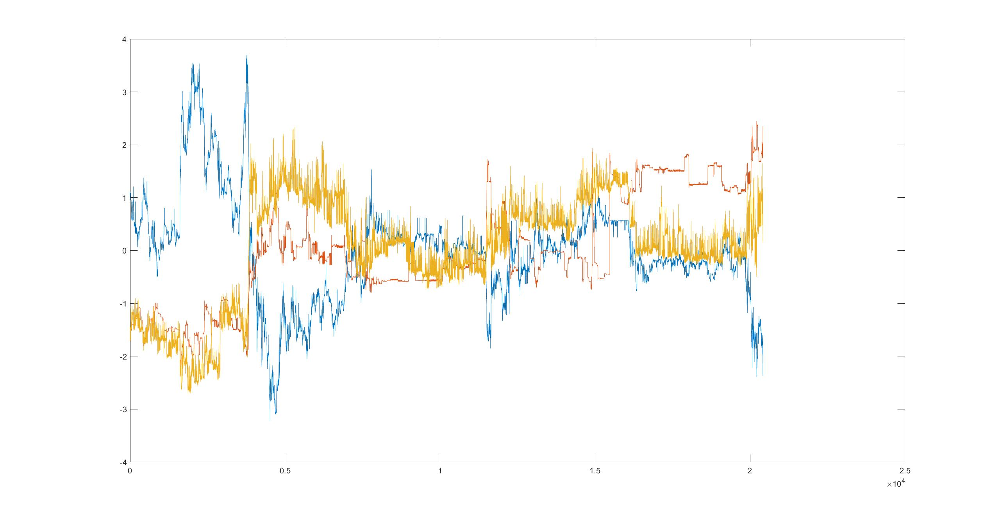
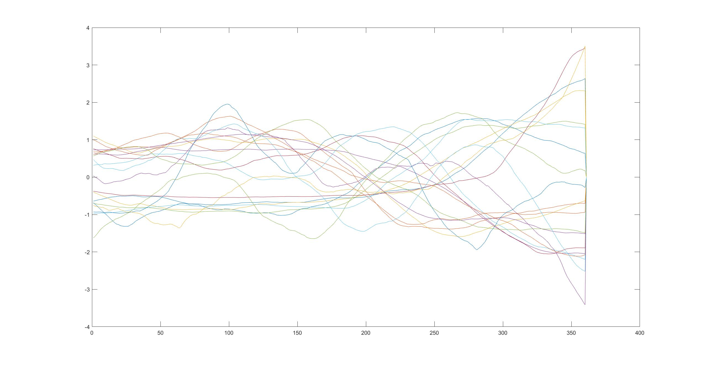

# btcpredictor

predicting bitcoin prices using bayesian regression techniques

### Update December 7th 2017
Price prediction right now from historical data is going to be very tricky, because no historical bitcoin data set will match current market behaviour. Consider HODLing. 

### Update June 15th 2017
I've spoken to a few people who are running servers to collect price data over time, and several them have had their servers crash from running out of memory. If you're doing something similar, either make sure you buy enough memory, or save the data regularly to persistant storage.

this project aims to implement the algorithm described in the 2014 MIT paper, Bayesian Regression and Bitcoin 
by Devavrat Shah and Kang Zhang. The paper is here -> https://arxiv.org/pdf/1410.1231v1.pdf

Method (from paper):
We partition our historical price data into three parts. 

We break the first third of the data into all possible consective intervals of sizes 180s, 360s and 720s. The algorithm applies k-means clustering to retrieve 100 cluster centers for each interval size, then uses Sample Entropy to narrow these down to the 20 best/most varied and hopefully most effective clusters.

It then uses the second set of prices to calculate the corresponding weights of features found using the bayesian regression method explained in the paper. The regression works as follows - at time t, we evaluate three vectors of past prices of different time intervals (180s, 360s and 720s). For each time interval, we calculate the similarity between these vectors and our 20 best kmeans patterns with their known price jump, to find the probabilistic price change dp_i. Our three dp_i's and the r value, calculated from bid and ask data, are our price prediction features. We then calculate the weights, w_i for each feature using a Differential Evolution optimisation function (source noted below).

The third set of prices is used to evaluate the algorithm, by running the same bayesian regression to evaluate features, and combining those with the weights calculated in step 2. 

## How to use it: 
All the relevant code is in MATLAB. I'm using version 2016b. The BTC price data is available as two csvs of okcoin or coinbase data at 5s intervals. The okcoin data also comes with bid volume and ask volume (number of bitcoins bidded/asked at time t).

- Run algotrading.m in matlab, which will carry out all three steps above and return, among other things, the points in time in which it decides to buy and sell, the final profit, the win rate, and the error.
- bayesian.m performs the bayesian regression (calculation of dp_i's)
- brtrade.m evaluates the weights using test data

The code is set up to make it easy to test your own csv data using test.m, after you've calculated the weights

## Status December 28, 2016
Over the three days, profit is around 1.1% and the win rate (percentage of the time that it successfully predicted the direction of the price jump) is ~80%. I am experimenting with adding transaction fees and taking spread into account.

Graph of BTC price over time for the three days of test data. Green dots are points in time when the algorithm decides to sell, Red is when it decides to buy. 

Price of bitcoin, with bid volume overlaid in yellow and ask volume overlaid in red. Plotted over one day 

A visualisation of the 20 'effective patterns' of length 360, created by clustering and applying sample entrepy over the historical data

Differences from the original paper:
- The code is not using r right now (from bid and ask volume data). 
- The trading structure has been simplified, so the algorithm is no longer capable of shorting bitcoin. 

## What Next
At this point the code is just a few functions away from calling the okcoin database in realtime to update historical price knowledge and running live trading decisions. However it should be trained/tested with a much larger dataset first (the authors in the paper were working over a timescale of several months) to see if this result scales. If I pursue that and get interesting results I will let you all know. 

## Attribution
The scraping of historical prices was done by Shaurya Saluja. The DE algorithm is available at http://www1.icsi.berkeley.edu/~storn/code.html. Major improvements were done by Han Li in adapting the DE and sample entropy code. 
All other code was written by me (Anvita Pandit).
If you find this useful, or want to discuss it further, I can be reached at pandit at mit dot edu
If you use this, do attribute me.

The csv files are available at https://bitbucket.org/anvitapandit/btcpredictor (too large for my github)
