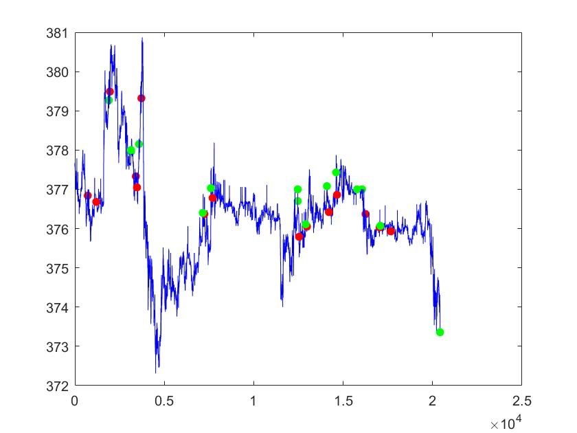

# btcpredictor
predicting bitcoin prices using bayesian regression techniques

this project aims to implement the algorithm described in the 2014 MIT paper, Bayesian Regression and Bitcoin 
by Devavrat Shah and Kang Zhang. The paper is here -> https://arxiv.org/pdf/1410.1231v1.pdf

We partition our historical price data into three parts. The algorithm first attempts to identify important patterns within historical price data using k-means clustering and sample with the first set of prices. It then uses the second set of prices to train weights for its predicted price function. This is where the Bayesian regression comes in - at time t, we evaluate three vectors of past prices of different time intervals. We compare these vectors to the known kmeans patterns with their known price change, to find a probabilistic average for the predicted price change at t.
The third set of prices is used to evaluate the algorithm. 

##How to use it: 
All the relevant code is in MATLAB, I'm using version 2016b. The BTC price data is available as two csvs of okcoin or coinbase data at 5s intervals. The okcoin data also comes with bid volume and ask volume (number of bitcoins bidded/asked at time t).
Run algotrading.m in matlab, which will carry out all three steps above and return, among other things, the points in time in which it decides to buy and sell, the final profit, the win rate, and the error.

bayesian.m performs the bayesian regression

brtrade.m performs the final evaluation

##Exciting News, Oct 24, 2016
a certain Han Li emailed me a number of code improvements, including the use of Sample Entropy to choose effective patterns, and a Differential Evolution optimisation function (instead of the previous linear regression code), and several bug fixes
the results are a lot more promising and make a very modest profit of about ~1% across three days trading on the historical data.

Graph of BTC price over time for the three days of test data. Green dots are points in time when the algorithm decides to sell, Red is when it decides to buy. the win rate is ~70%

The trading structure has also been changed so that the algorithm is no longer capable of shorting bitcoin, which is reflective of the major bitcoin markets. There is now an option to use Matlab's parpool command to parallelize the kmeans clustering. 
I also realized matlab doesn't do garbage collection, and have thus added a lot more cleanup in between calculation

## What Next
At this point the code is just a few functions away from calling the okcoin database in realtime to update historical price knowledge and running live trading decisions. However it should be trained/tested with a much larger dataset first (the authors in the paper were working over a timescale of several months) to see if this result scales. If I pursue that and get interesting results I will let you all know. 

##Attribution
The scraping of historical prices was done by Shaurya Saluja. The DE algorithm is available at http://www1.icsi.berkeley.edu/~storn/code.html. Major improvements in adding the DE and sample entropy were implemented by Han Li, buy-sell graph created by Han Li.
All other code was written by me (Anvita Pandit).
If you find this useful, or want to discuss it further, I can be reached at pandit at mit dot edu
If you use this, do attribute me.

The csv files are available at https://bitbucket.org/anvitapandit/btcpredictor (too large for my github)
